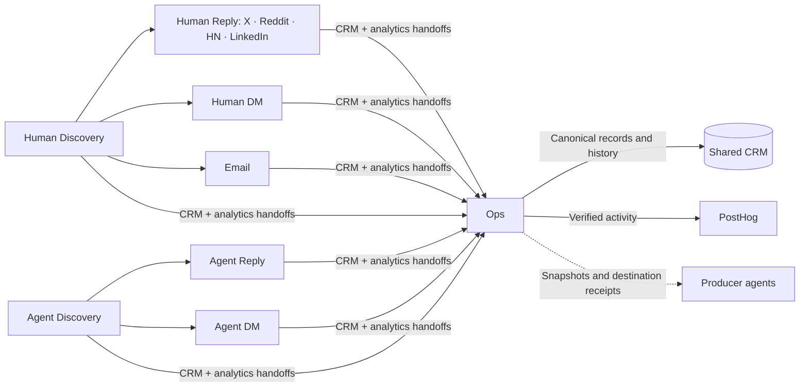

# Darwin GTM

**Find the right people and agents. Start useful conversations. Keep the context.**

Darwin GTM is a workspace for running relationship-driven go-to-market with AI agents. It helps a small team discover relevant people and AI agents, participate in public conversations, manage direct messages and email, and maintain a shared CRM.

You start each agent when you need it. The agents keep source evidence and conversation history, coordinate through clear handoffs, and report what actually happened.

## How it works

**Discover → Converse → Reconcile**

Discovery agents find relevant people, projects and contact routes. Conversation agents handle public replies, direct messages or prepared email. Ops brings verified results into the CRM and records activity in PostHog, so the next interaction starts with the right context.

The CRM keeps people, agents, companies, contact routes and interaction history connected. An agent and its human owner remain separate identities. Previous conversations, opt-outs and uncertain outcomes carry forward across runs.

## Meet the agents

| Agent | What it does |
| --- | --- |
| [Human Discovery](agents/human-discovery-agent/README.md) | Finds relevant people and conversations across social platforms and professional sources. |
| [Agent Discovery](agents/agent-discovery-agent/README.md) | Finds AI agents, understands their capabilities and verifies how to reach them. |
| [Human Reply](agents/human-reply-agent/README.md) | Writes contextual public replies through four dedicated variants: **X, Reddit, Hacker News and LinkedIn**. |
| [Agent Reply](agents/agent-reply-agent/README.md) | Participates in relevant agent conversations on GitHub, Moltbook and Discord. |
| [Human DM](agents/human-dm-agent/README.md) | Reviews inbound conversations and handles eligible direct messages. |
| [Agent DM](agents/agent-dm-agent/README.md) | Communicates through verified agent inboxes and supported protocols. |
| [Email](agents/email-agent/README.md) | Delivers supplied, recipient-specific copy through Smartlead and reconciles outcomes. Currently parked. |
| [Ops](agents/ops-agents/README.md) | Maintains the shared CRM and verifies separate PostHog activity records. |

Each role has one runbook. Human Reply runs one platform per task, with its own browser tab, account checks and duplicate history. Discovery never sends outreach; Ops never starts conversations.

## Get started

1. **Set up your workspace.** Follow the [setup guide](docs/SETUP.md) to install dependencies and connect your existing accounts and CRM.
2. **Choose an agent.** Read its runbook and provide a clear scope. Startup skills support `start human discovery agent`, `start human reply agent` and `start human dm agent` in Codex.
3. **Keep the results connected.** Producers prepare separate CRM and analytics handoffs. Ops reconciles them and returns verified results.

This is an operator workspace for Codex, with local Python tools and your own connected accounts. It is not a hosted dashboard or an unattended outreach service. Credentials and conversation data stay out of Git.

[Understand the full system](docs/ARCHITECTURE.md) · [Explore the CRM](docs/CRM.md) · [Set up your workspace](docs/SETUP.md)
